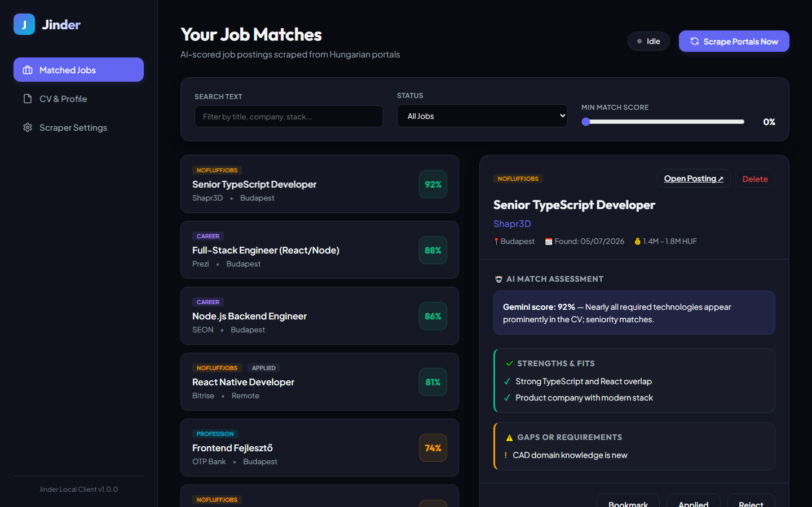
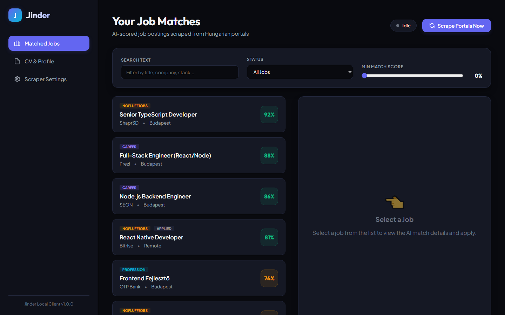
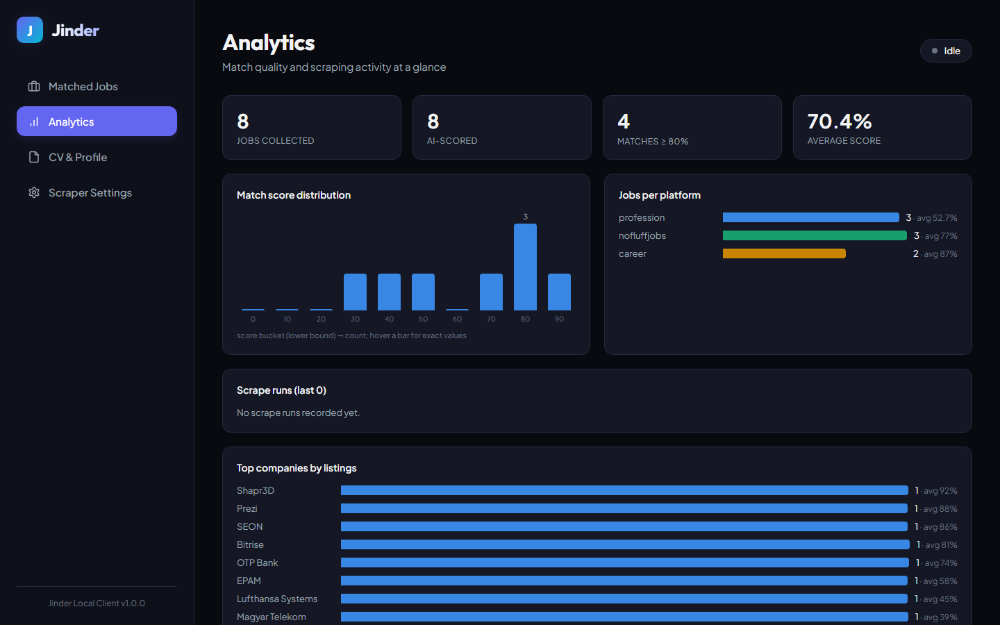
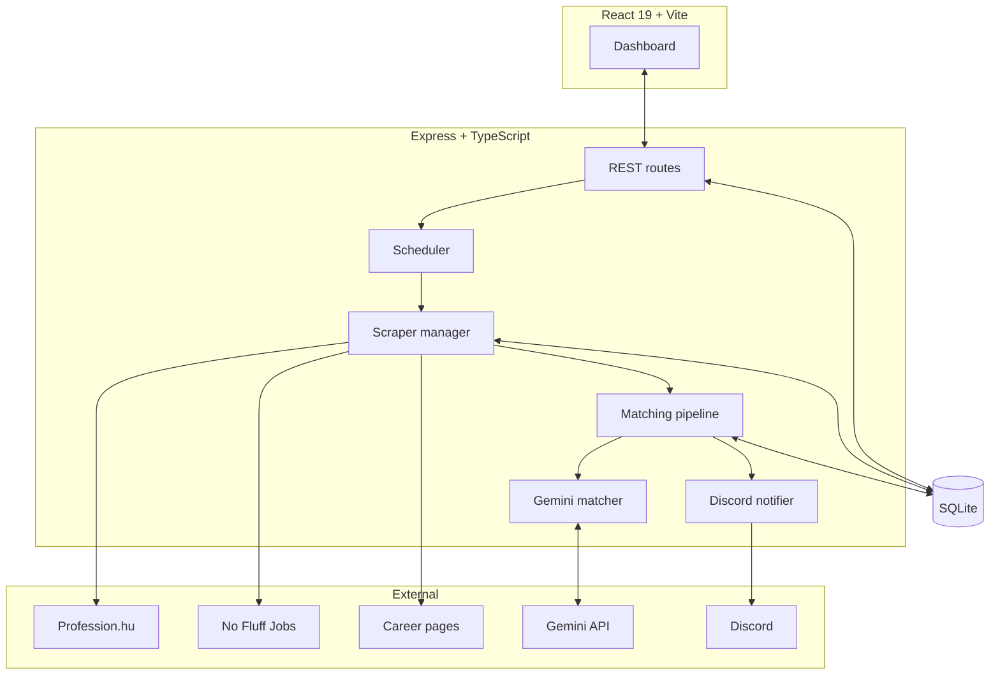

# Jinder 🚀

[](https://github.com/Daemon0928/Jinder/actions/workflows/ci.yml)

**Jinder** (Job Finder) is a self-hosted, AI-powered job hunting assistant for the Hungarian tech market. It scrapes job boards and company career pages, semantically matches every posting against **your CV** using Gemini, scores them 0–100%, and pings you on Discord the moment a strong match appears.



## Why

Job boards make you search; Jinder makes the jobs come to you — pre-scored, translated to English, with an honest AI breakdown of *why you fit and where you fall short* for each posting.

## Key Features

- **Multi-source scraping** — Profession.hu (Cheerio), No Fluff Jobs (API + Playwright fallback), and arbitrary **company career pages** discovered via search engines and parsed with Gemini link extraction.
- **CV-aware AI matching** — upload a PDF (or paste text); Gemini summarizes it, then batch-evaluates every new posting against it: match score, pros, cons, justification, tech stack, salary — with seniority gaps hard-capping the score.
- **Cross-platform dedup** — the same vacancy found on multiple boards shares one AI evaluation (fewer Gemini calls) and is badged "also on …" in the UI.
- **Analytics dashboard** — score distribution, per-platform quality, scrape-run history, and top companies.
- **Discord alerts** — matches ≥ 80% trigger a webhook notification with the score and reasoning.
- **Background scheduler** — periodic scraping runs with live progress, run history, and CV re-evaluation after you update your profile.
- **Application tracking** — bookmark, mark applied, or reject; filter by status, score, and free text.
- **Self-hosted & private** — single container, SQLite storage, optional bearer-token auth. Your CV never leaves your machine except to the Gemini API.

| Jobs list | Analytics |
| --- | --- |
|  |  |

## Quickstart (Docker)

```bash
cp .env.example .env          # add your GEMINI_API_KEY
docker compose up --build jinder
# open http://localhost:5000
```

### Try it without an API key

```bash
npm install && npm run seed:demo && npm run dev
# open http://localhost:5000 — dashboard populated with demo matches
```

## Local Development

Prerequisites: Node.js 20/22, npm 10+.

```bash
npm install
npm install --prefix client
npx playwright install chromium   # for the scraping fallbacks

npm run dev            # backend on :5000 (hot reload)
npm run frontend:dev   # Vite dev server on :5173 (proxies /api)
```

Production build: `npm run build && npm start` — the Express server serves both the API and the compiled frontend on port 5000.

## Configuration

Copy `.env.example` to `.env`:

| Variable | Required | Description |
| --- | --- | --- |
| `GEMINI_API_KEY` | for matching | Google Gemini API key. Without it the app runs but skips AI matching. |
| `GEMINI_MODEL` | no | Model id (default `gemini-2.5-flash-lite`). |
| `PORT` | no | Backend port (default `5000`). |
| `AUTH_TOKEN` | no | When set, every `/api` request must send `Authorization: Bearer <token>`. |
| `CORS_ORIGIN` | no | Allowed origin for cross-origin API calls (default Vite dev origin). |
| `DB_FILE` | no | SQLite file path (default `./jobs.db`). |

Everything else — keywords, locations, exclude keywords, target companies, Discord webhook, batch size, scheduler interval — is configured in the web UI and stored in SQLite.

## Architecture



A scrape run: search all sources in parallel (one shared Chromium instance) → dedupe against the DB → politely fetch details sequentially → batch-match against the CV via Gemini (with per-job fallback and LLM-output validation) → save + alert. See [docs/ARCHITECTURE.md](docs/ARCHITECTURE.md) for the full walkthrough and design decisions.

## Testing

```bash
npm test          # 36 unit tests (vitest): SSRF guard, matching pipeline, retry, locations
npm run test:e2e  # 71 end-to-end cases against the real server with mocked portals + Gemini
npm run typecheck
```

The e2e suite boots a mock HTTP server that simulates Profession.hu, No Fluff Jobs, search engines, and Discord webhooks, then drives the actual Express app over HTTP and asserts on responses, SQLite state, and captured webhooks. CI runs all of it plus lint, both builds, and a Docker image build on every push.

## Security Notes

- Optional bearer-token auth (`AUTH_TOKEN`) protects all API routes.
- The Discord webhook is write-only: the API never echoes the stored URL back.
- User-supplied career-page URLs are validated against SSRF (no `file://`, no private/loopback/link-local targets, DNS-resolved).
- Runs as a non-root user in Docker with a `/healthz` healthcheck.

## Limitations

- **No LinkedIn scraper** — LinkedIn's ToS prohibits scraping and its anti-bot measures make it impractical to do politely; deliberately out of scope.
- Scrapers depend on the current HTML/API structure of Profession.hu and No Fluff Jobs; selector drift can reduce results until updated.
- Match quality is bounded by the LLM: scores are a triage signal, not a verdict.
- Single-user by design (one CV, one config).

## Roadmap

- Application-tracking kanban (`new → interested → applied → interview → offer/rejected`) with per-job notes.
- Weekly email digest of top new matches (generalizing the Discord notifier into a channel interface).

## Project Structure

```
src/                 Express backend (routes/, scrapers/, matching/, matcher/, notify/, lib/, db/)
client/src/          React frontend (api/, hooks/, components/, context/)
tests/unit/          Vitest unit tests
tests/e2e/           Mocked end-to-end suite (mock server + runner + 71 cases)
scripts/seed-demo.ts Demo data seeder
docs/                Architecture notes, screenshots, devlog
```
