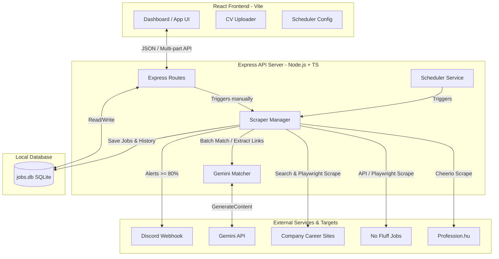

# Jinder (Job Finder) 🚀

Jinder is a self-hosted, AI-powered job scraping, semantic matching, and alerting application designed to automate the process of finding software development and tech roles in Hungary. 

By comparing your CV against scraped job descriptions using Gemini LLM, Jinder ranks opportunities by relevance, highlights pros and cons, and notifies you immediately on Discord when a highly compatible role is discovered.

---

## Table of Contents
1. [Key Features](#key-features)
2. [Architecture & Technology Stack](#architecture--technology-stack)
3. [Project Directory Structure](#project-directory-structure)
4. [Environment Configuration](#environment-configuration)
5. [Local Installation & Run Guide](#local-installation--run-guide)
   - [Prerequisites](#prerequisites)
   - [Development Setup](#development-setup)
   - [Production Build & Running](#production-build--running)
6. [Docker Deployment](#docker-deployment)
7. [User Guide (Workflow)](#user-guide-workflow)
8. [Database Schema Details](#database-schema-details)
9. [Scraper Pipeline Details](#scraper-pipeline-details)
10. [Background Scheduler & History](#background-scheduler--history)
11. [Testing & Verification](#testing--verification)

---

## Key Features

- **Multi-Channel Scrapers**:
  - **Profession.hu**: Scrapes listings using fast Cheerio parsing with multi-page support.
  - **No Fluff Jobs**: Leverages the official API search endpoint with a headless Playwright browser fallback if blocked.
  - **Company Career Pages**: Discovers career pages via automated Google/Bing/DuckDuckGo search queries, crawls them using Playwright, extracts candidates, and utilizes Gemini to target specific vacancy URLs.
- **Automated CV Processing**:
  - Upload a PDF CV or paste raw text.
  - Parses PDF files using `pdf-parse` (with a plain-text fallback in test environments).
  - Summarizes CVs using Gemini into structured English sections (Professional Summary, Skills, Experience, Education, Languages).
- **Gemini Semantic Matching**:
  - Analyzes Hungarian/English postings, translates details to English, and matches them against the CV.
  - Computes a match score (0-100%), extracts 2-4 pros and cons, and generates a clear justification.
  - **Experience Weighting**: Prioritizes experience alignment. Match score is capped at 75% max if there is a significant experience/seniority gap (e.g., job requires 5+ years, user has 3 years).
  - **Batch Matching**: Matches jobs in groups (configurable batch size, default 10) in a single Gemini API call to significantly reduce token usage and API costs (with a robust individual fallback).
  - **CV Reevaluation**: Trigger matching reevaluation for all existing scraped jobs in the database using a custom batch size.
- **Exclude Keywords Filtering**:
  - Prevent undesired jobs from being matched or saved by specifying exclude keywords (checked against titles before fetching details, and against description text post-fetch).
- **Discord Alerting Webhook**:
  - Instantly broadcasts formatted alerts (including matching scores, links, and justifications) to a Discord channel if a job score is $\ge 80\%$.
- **Automated Background Scheduler**:
  - Runs scraping runs periodically based on keywords and locations.
  - Configurable execution interval (in hours) with toggle settings.
  - Monitors detailed run results (new jobs, matched count, errors) through a dedicated `scrape_history` view.
- **Responsive Web Dashboard**:
  - React (v19) + Vite frontend to track applications.
  - Drag-and-drop PDF uploader, scheduler configuration form, target company manager, keyword/location/exclude-keyword filters, batch size fields, manual CV matcher trigger, and detailed job dialogs.
  - Categorize jobs into `new`, `bookmarked`, `applied`, and `rejected` states.


---

## Architecture & Technology Stack



### Stack Breakdown
- **Runtime**: Node.js (v22 / LTS recommended)
- **Language**: TypeScript (v6)
- **Backend Framework**: Express (v5)
- **Database**: SQLite via `better-sqlite3` (with Write-Ahead Logging `WAL` mode enabled for performance)
- **Scraping Frameworks**: Playwright (for dynamic HTML pages) & Cheerio (for static parsing)
- **AI SDK**: `@google/genai` (utilizing `gemini-3.1-flash-lite` or specified models)
- **Frontend Framework**: React (v19) + Vite
- **Media Parsing**: `pdf-parse` (for PDF text extraction)

---

## Project Directory Structure

```
Jinder/
├── client/                     # Frontend Vite + React application
│   ├── src/
│   │   ├── App.tsx             # Main dashboard UI component (54KB rich application)
│   │   ├── index.css           # Styling styles and layout rules
│   │   └── main.tsx            # React entry point
│   ├── index.html
│   ├── vite.config.ts          # Vite config (proxies /api to port 5000)
│   └── package.json
├── src/                        # Backend Express + TS application
│   ├── db/
│   │   └── database.ts         # SQLite DB instantiation, WAL mode, schema initialization
│   ├── matcher/
│   │   └── gemini.ts           # Gemini API wrappers (CV summarize, job matching, batch matching)
│   ├── scrapers/
│   │   ├── profession.ts       # Profession.hu parsing logic
│   │   ├── nofluffjobs.ts      # No Fluff Jobs scraper (API + Playwright fallback)
│   │   ├── careerPages.ts      # Search engine discovery and dynamic career site crawler
│   │   └── scraperManager.ts   # Entrypoint orchestrator merging results & scheduling matches
│   ├── scheduler.ts            # Periodic cron-like job queue and status metrics tracker
│   └── server.ts               # Express app routes (CV upload, scraper run, configurations)
├── tests/                      # Testing workspace
│   ├── e2e/                    # Complete E2E mock verification engine
│   │   ├── test-cases.ts       # Detailed mock test case parameters (63 tests)
│   │   ├── mock-server.ts      # Offline servers simulating Gemini & job platforms
│   │   ├── database-helper.ts  # Database isolation wrappers
│   │   └── run-tests.ts        # Main test execution file
│   └── scratch/                # Manual verification scratch scripts and mock HTML pages
├── Dockerfile                  # Application build container configuration
├── docker-compose.yml          # Composition services (app on port 5000, tests service)
├── jobs.db                     # SQLite database file (local only, git-ignored)
├── tsconfig.json               # TypeScript configuration
├── package.json                # Root server package and script configuration
└── README.md                   # User documentation (this file)
```

---

## Environment Configuration

A `.env` file must be created in the root directory. Copy `.env.example` as a starting point:

```bash
cp .env.example .env
```

### Variables Description:
- **`GEMINI_API_KEY`**: Your Google Gemini API Key. (Required for CV summarization, career page link extraction, and job matching).
- **`GEMINI_MODEL`**: The model identifier. Recommended default: `gemini-3.1-flash-lite` (supports cost-effective matching).
- **`PORT`**: The backend server port (defaults to `5000`).

---

## Local Installation & Run Guide

### Prerequisites
- **Node.js**: Version 20 or 22 (LTS) is highly recommended.
- **npm**: Version 10+.
- **SQLite**: Local runtime libraries.

### Development Setup
1. **Clone the repository**:
   ```bash
   git clone <repo-url> Jinder
   cd Jinder
   ```
2. **Install all dependencies**:
   Install root dependencies, then install frontend dependencies:
   ```bash
   npm install
   npm install --prefix client
   ```
3. **Install Playwright Browsers**:
   Ensure Playwright has the required browser binaries:
   ```bash
   npx playwright install chromium
   ```
4. **Run in Development Mode**:
   Launch the backend server (on port `5000` with hot-reload via `tsx`) and frontend client (on port `5173` via Vite):
   - **Terminal 1 (Backend)**:
     ```bash
     npm run dev
     ```
   - **Terminal 2 (Frontend)**:
     ```bash
     npm run frontend:dev
     ```
   Now, open your browser and navigate to `http://localhost:5173`.

### Production Build & Running
To compile the TypeScript code and bundle the frontend assets for production:
1. **Compile Backend and Frontend**:
   ```bash
   npm run build
   npm run frontend:build
   ```
   *This compiles TypeScript files to `dist/` and builds the React app into `dist/frontend/`.*
2. **Run Server**:
   ```bash
   npm run start
   ```
   The backend server will run on `http://localhost:5000`, serving both the REST APIs and the compiled static frontend files.

---

## Docker Deployment

Jinder can be fully run inside a Linux container using Docker. This avoids needing local node, python, or chrome binary setups.

### Build & Start the Application
To build the image and spin up the container:
```bash
docker compose up --build jinder
```
The application will start, mapping port `5000` to the host. You can access the dashboard at `http://localhost:5000`. Database data is persisted in a Docker volume named `jinder-data`.

### Run the E2E Test Suite
To execute the comprehensive offline mock tests inside the container environment:
```bash
docker compose run --rm tests
```
*This builds the test image, runs the E2E test scripts, and shuts down immediately.*

---

## User Guide (Workflow)

When launching the Jinder dashboard for the first time, follow this setup checklist:

### 1. Upload or Paste Your CV
- Go to the **CV & Profile** tab.
- Drag and drop your CV PDF file into the uploader, or paste it as plain text.
- Jinder will extract the text, send it to Gemini, and present a structured English summary containing your core competencies, technologies, and roles.

### 2. Configure Keywords & Locations
- Define the search keywords (e.g. `Developer`, `Typescript`, `Architect`, `szoftverfejlesztő`) in the settings section.
- Input location filters (e.g. `budapest`, `debrecen`, `remote`) to narrow down scrapers.

### 3. Add Target Companies (Optional)
- Under the **Company Careers** section, add specific companies you want to track (e.g. `Prezi`, `Shapr3D`, `Lufthansa Systems`).
- The scrapers will search for and check their internal job boards.

### 4. Enable Discord Notifications (Optional)
- Create a webhook in your Discord server channel settings.
- Copy the webhook URL and paste it into Jinder's configuration panel.
- Save settings. Any matched position scoring $\ge 80\%$ will now trigger an alert in your channel.

### 5. Trigger Scraping & Schedule
- Click **Scrape Now** to run a manual scraper sweep. The backend will display active status indicators representing searching, fetching details, semantic matching, and database storage phases.
- Configure the background **Scheduler Service** to run automatically (e.g. every `4` or `12` hours).

### 6. Manage Matched Positions
- Review findings in the **Jobs** grid.
- Sort by matching percentage. Click any card to read:
  - Translated English title, company, and location details.
  - Job description.
  - **Pros** (reasons why you fit).
  - **Cons** (missing technologies or experience gaps).
  - **Justification** (LLM analysis summarizing the fit).
- Mark jobs as **Bookmarked**, **Applied**, or **Rejected** to keep track of your applications.

---

## Database Schema Details

Jinder utilizes an SQLite file named `jobs.db` in the project root. The schema contains four primary tables:

### 1. `jobs`
Stores details of all scraped and matched vacancies.
- `id` (INTEGER, Primary Key, Auto-increment)
- `job_id` (TEXT, Unique, e.g. `profession-12345` or `nofluffjobs-slug`)
- `platform` (TEXT, e.g. `profession`, `nofluffjobs`, or `career`)
- `title` (TEXT)
- `company` (TEXT)
- `location` (TEXT)
- `link` (TEXT)
- `description` (TEXT, raw content scraped)
- `parsed_json` (TEXT, JSON representation of Gemini-extracted details)
- `match_score` (INTEGER, default `-1`)
- `match_pros` (TEXT, JSON list of strings)
- `match_cons` (TEXT, JSON list of strings)
- `match_justification` (TEXT)
- `status` (TEXT, default `'new'`. Options: `'new'`, `'bookmarked'`, `'applied'`, `'rejected'`)
- `created_at` (TEXT, Timestamp)

### 2. `config`
Stores configuration key-value pairs.
- `key` (TEXT, Primary Key)
- `value` (TEXT)
- *Preseeded Keys*: `scheduler_interval_hours` (default `'4'`), `scheduler_enabled` (default `'false'`). Other dynamic keys: `cv`, `cv_summary`, `cv_filename`, `keywords`, `exclude_keywords`, `locations`, `companies`, `discord_webhook`, `batch_size`.

### 3. `career_page_cache`
Caches company career page URLs to avoid repeating search-engine queries.
- `id` (INTEGER, Primary Key)
- `company_name` (TEXT, Unique)
- `career_url` (TEXT)
- `discovered_at` (TEXT)

### 4. `scrape_history`
Tracks audit metrics for every scraping execution run.
- `id` (INTEGER, Primary Key)
- `started_at` (TEXT)
- `finished_at` (TEXT)
- `trigger` (TEXT, `'scheduled'` or `'manual'`)
- `total_scraped` (INTEGER)
- `new_jobs` (INTEGER)
- `matched` (INTEGER)
- `errors` (TEXT, JSON list of error messages)
- `status` (TEXT, `'running'`, `'completed'`, or `'failed'`)

---

## Scraper Pipeline Details

The orchestrator in [scraperManager.ts](file:///C:/Users/mark2/repos/Jinder/src/scrapers/scraperManager.ts) processes jobs in three phases:

1. **Search & Discovery**:
   - Executes queries across active scrapers (Profession, No Fluff Jobs, and Company Careers).
   - Combines results in-memory.
   - Filters out duplicates against existing database records based on `job_id`.
   - Filters out jobs containing any configured **Exclude Keywords** (matching on job title at this stage to avoid unnecessary details fetches).
2. **Polite Detail Extraction**:
   - For all new listings, the runner visits detail pages sequentially.
   - Restricts rate by introducing a **1.5-second sleep interval** between fetches.
   - Once detail text is fetched, checks again for **Exclude Keywords** (matching on job description text) and drops any matches.
3. **LLM Evaluation**:
   - Packages new listings into batches of configurable size (defaults to 10, editable in settings).
   - Submits the CV and batch payload to Gemini using a structured JSON Schema.
   - **Experience Weighting**: The AI model weights years of experience mismatch heavily; if the job required experience level exceeds the user's CV experience significantly (e.g. user has 3 years, job requires 5+), the score is capped at a maximum of 75%.
   - If a batch call fails (e.g. due to context length or connection limits), it transparently falls back to individual evaluations.
   - Saves final records in SQLite and sends webhook notifications if applicable.

---

## Background Scheduler, History & Reevaluation

The background service in [scheduler.ts](file:///C:/Users/mark2/repos/Jinder/src/scheduler.ts) manages periodic execution and reevaluation:
- Automatically loads status from database config upon server bootstrap.
- Uses standard JS intervals to coordinate execution loops without locking thread execution.
- Exposes detailed real-time progress indicators: current phase (including `'reevaluating'`), active keyword index, total matching progress, and encountered error count.
- Logs historical metrics in `scrape_history` for user review.
- **CV Reevaluation**: Allows reevaluating all existing jobs in the database (e.g. after uploading a new CV) using a customizable batch size.


---

## Testing & Verification

Jinder comes with a comprehensive, fully-mocked E2E test engine located in [tests/e2e/](file:///C:/Users/mark2/repos/Jinder/tests/e2e/).

### What it does:
- Starts a mock HTTP server in the background (on port `5001`) that intercepts all requests.
- Simulates HTML structures for Profession.hu, No Fluff Jobs, Google Search pages, and target company landing pages.
- Intercepts Gemini API calls (`MOCK_GEMINI=true`), returning deterministic mock JSON scoring, summaries, and career link extraction arrays.
- Validates edge-cases: duplicate listings, network failures, empty search results, batch-matching fallbacks, and scheduler intervals.

### Executing Tests:
To run the E2E suite locally:
1. Set env flags:
   ```bash
   $env:NODE_ENV="test"
   $env:MOCK_GEMINI="true"
   $env:DB_FILE="jobs.test.db"
   ```
2. Run the test suite:
   ```bash
   npx tsx tests/e2e/run-tests.ts
   ```
Alternatively, execute it through Docker with:
```bash
docker compose run --rm tests
```
All 63 test cases should pass cleanly, verifying database states, response schema shapes, and backend API routes.
